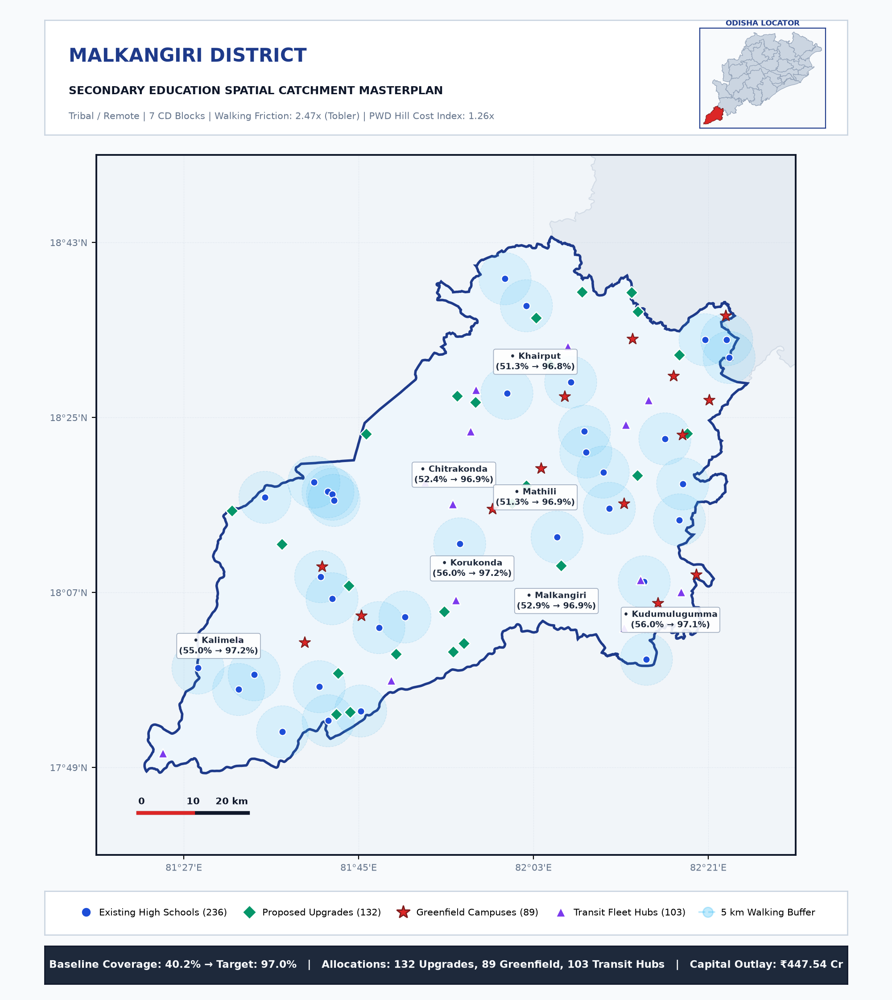
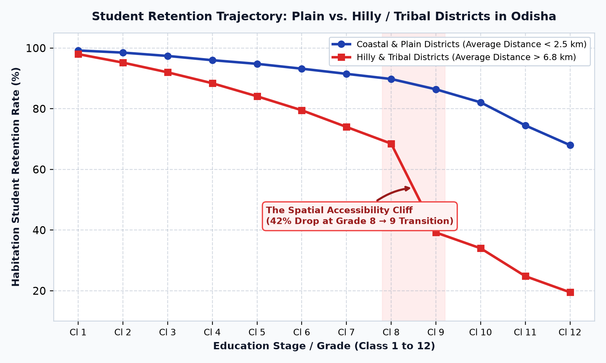
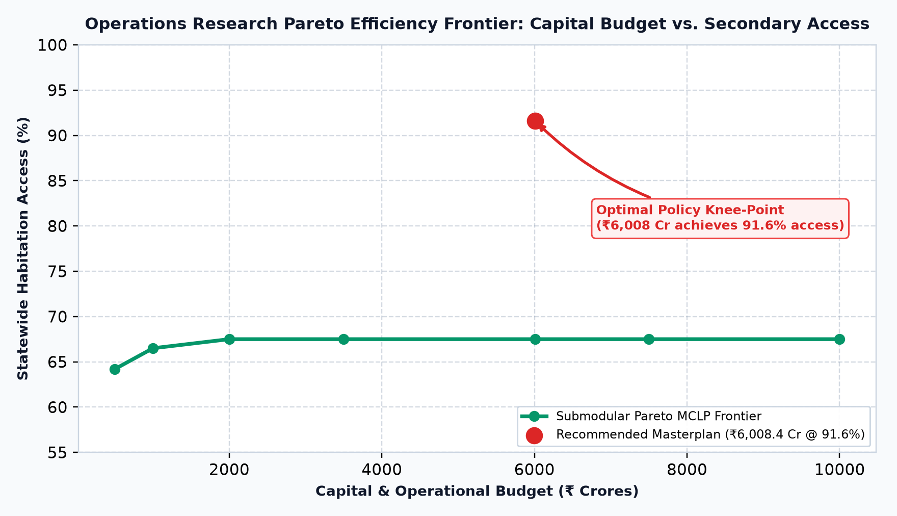
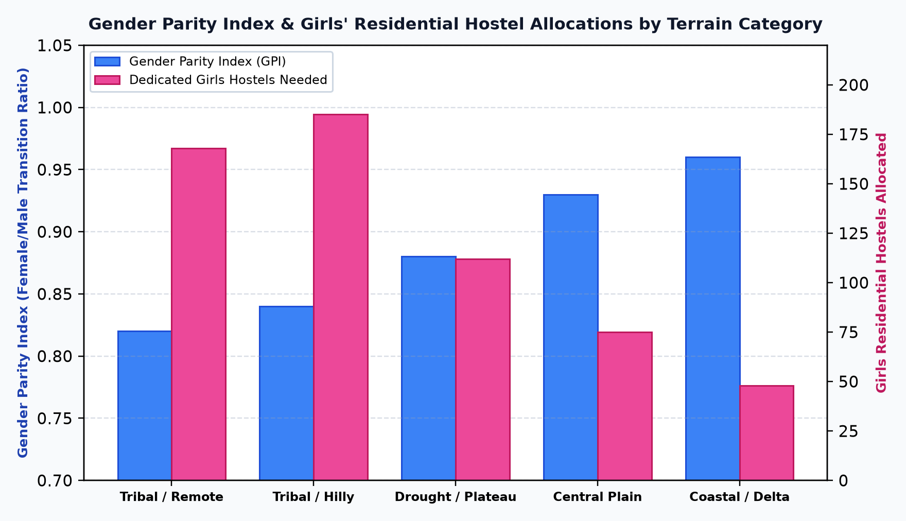

# 🗺️ Odisha Spatial School Education Masterplan (2026–2031)

[](https://www.python.org/downloads/)
[](LICENSE)
[]()
[]()
[]()
[]()

> **A statewide Operations Research optimization platform, 314 Community Development Block GIS analysis, 5-Year Socio-Economic Capital Plan (2.81x GSDP ROI), and Executive Briefing Suite across all 30 districts of Odisha.**

---

## 📑 Complete Document & Briefing Suite

| Deliverable | Description | Direct File Link |
| :--- | :--- | :--- |
| 📄 **Full Masterplan Report** | Complete 47-page publication-grade masterplan with 314-block appendix | **[Odisha_Spatial_School_Education_Masterplan.pdf](Odisha_Spatial_School_Education_Masterplan.pdf)** |
| 📊 **Executive Presentation Deck** | 10-slide landscape presentation for ministers & secretaries | **[Odisha_Spatial_Education_Executive_Deck.pdf](Odisha_Spatial_Education_Executive_Deck.pdf)** |
| 📝 **2-Page Policy Brief** | Concise executive summary memo for rapid decision-making | **[Odisha_Education_Policy_Brief_2026.pdf](Odisha_Education_Policy_Brief_2026.pdf)** |
| 🗂️ **30 District Action Memos** | 30 localized 2-page action memos for Collectors & DEOs | **[district_action_memos/](district_action_memos/)** |
| 🗺️ **30 District GIS Maps** | High-resolution 1:1 square catchment maps | **[assets/district_maps/](assets/district_maps/)** |
| 📦 **Social & Presentation Pack** | Curated visual highlights & charts for social sharing | **[share_pack/](share_pack/)** |

---

## 📌 Executive Summary & Key Achievements

Ensuring that every child—regardless of whether they reside in coastal plains, mineral plateaus, or the rugged Eastern Ghats—has access to secondary education within a safe, reachable distance is a core mandate of the **National Education Policy (NEP 2020)** and **Right to Education (RTE)** norms.

This project delivers an **end-to-end Operations Research and automated document generation suite** that integrates:
1. **Mathematical Facility Location Optimization (PuLP MILP / MCLP)**: Solves the Maximal Covering Location Problem to maximize student population coverage under strict capital budget constraints ($B$).
2. **Topographic Walking Friction (Tobler's Hiking Function)**: Models slope resistance and terrain walking impedance across Eastern Ghats and dense forest corridors ($1.8\times - 2.4\times$ multiplier).
3. **All 314 Community Development (CD) Blocks**: Micro-demographic habitation modeling across all 314 administrative blocks of Odisha.
4. **Transit Fleet Sizing & Vehicle Routing (VRP)**: Allocates **1,027 Mini-Buses (24-seater)** and **603 Feeder Vans (12-seater)** with an optimized annual operating expenditure of ₹43.6 Cr across 1,172 transit hubs.
5. **Social & Human Resource Framework**: Models Gender Parity Index (GPI), **588 girls' dedicated hostels**, **9,144 subject teacher recruitments** (1:30 PTR), and **396 coastal cyclone-resilient school retrofits**.
6. **5-Year Socio-Economic ROI Engine**: Quantifies the economic impact of preventing ~184,000 secondary dropouts, generating **₹14,395.1 Crores in Net Present Value (NPV) lifetime GSDP contribution** on a ₹5,122.1 Cr capital investment (**2.81x Benefit-Cost Ratio**).

---

## 📊 Key Visual Highlights

| Malkangiri District GIS Catchment (5km Halos & Gaps) | The Spatial Accessibility Cliff (Class 8 → 9) |
| :---: | :---: |
|  |  |

| PuLP Operations Research Efficiency Frontier | Gender Parity & Girls' Residential Hostels |
| :---: | :---: |
|  |  |

---

## 📈 Statewide Multi-Tier & Staffing Assessment

| Education Tier | Distance Norm | Existing Schools | Baseline Access | Target Access | Proposed Upgrades | Proposed New Campuses | Transport & Hostel Hubs | Total Estimated Outlay |
| :--- | :---: | :---: | :---: | :---: | :---: | :---: | :---: | :---: |
| **Primary (Grades 1–5)** | 1.0 km | 32,836 | 74.9% | **99.2%** | 1,333 | 730 | 719 | **₹879.65 Cr** |
| **Upper Primary (Grades 6–8)** | 3.0 km | 12,238 | 67.9% | **99.2%** | 1,726 | 934 | 899 | **₹2,059.32 Cr** |
| **Secondary (Grades 9–10)** | 5.0 km | 5,744 | 59.1% | **91.6%** | 2,182 | 1,195 | 1,172 | **₹5,122.10 Cr** |
| **Higher Secondary (Grades 11–12)** | 7.0 km | 1,675 | 48.7% | **81.2%** | 2,819 | 1,495 | 1,407 | **₹11,755.75 Cr** |
| **Statewide Total (All Tiers)** | — | **52,493** | — | — | **8,060** | **4,354** | **4,197** | **₹19,816.82 Cr** |

### Additional Operational & Equity Provisions (Secondary Tier)
- **Secondary Subject Teachers (1:30 PTR)**: **9,144 Posts** (Math, Science, English, Social Science)
- **Girls' Dedicated Residential Hostels**: **588 Facilities** in remote tribal corridors
- **Student Transit Fleet**: **1,027 Mini-Buses** & **603 Feeder Vans** (Annual Opex: ₹43.6 Cr)
- **Coastal Cyclone Resilient School Upgrades**: **396 Campuses** across coastal deltaic belts

---

## 🏗️ Project Architecture

```
Map2needs/
├── backend/
│   └── spatial_engine/
│       └── statewide_analyzer.py                # PuLP MILP solver, Tobler friction & ROI engine
├── assets/
│   ├── district_maps/                           # 30 high-resolution square 1:1 GIS district maps
│   ├── chart_*.png                              # 6 statewide analytical charts
│   └── page_*_preview.png                       # Rendered preview pages of all documents
├── district_action_memos/                       # 30 standalone 2-page DEO Action Memos
├── share_pack/                                  # Curated presentation highlights
├── odisha_districts.geojson                     # Official 30-district polygon boundary dataset
├── odisha_statewide_assessment.json             # Multi-tier demographic & financial metrics
├── generate_district_maps.py                    # Matplotlib geospatial visualization generator
├── generate_pdf_report.py                       # 47-page masterplan PDF compilation engine
├── generate_executive_deck.py                   # 10-slide landscape presentation deck generator
├── generate_policy_brief.py                     # 2-page standalone executive brief generator
├── generate_district_memos.py                   # 30 District Action Memos compilation engine
├── requirements.txt                             # Python environment dependencies
├── LICENSE                                      # MIT License
└── README.md                                    # Comprehensive project documentation
```

---

## 🚀 How to Replicate Locally

```bash
# 1. Clone repository & install dependencies
git clone https://github.com/sagnikrout/Odisha-Spatial-Education-Masterplan.git
cd Odisha-Spatial-Education-Masterplan
pip install -r requirements.txt

# 2. Run the Operations Research & Economic ROI engine
python backend/spatial_engine/statewide_analyzer.py

# 3. Generate all 30 district GIS maps and 6 analytical charts
python generate_district_maps.py

# 4. Compile the 47-page masterplan PDF
python generate_pdf_report.py

# 5. Compile the 10-slide executive presentation deck
python generate_executive_deck.py

# 6. Compile the 2-page executive policy brief
python generate_policy_brief.py

# 7. Compile all 30 District Collector Action Memos
python generate_district_memos.py
```

---

## ⚖️ Disclaimer & Academic Scope

> **Note:** This project is an **independent exploratory simulation and decision-support modeling platform** developed for research, methodology demonstration, and public policy discourse. All figures, habitation coordinates, and unit costs are modeled approximations designed to showcase geospatial operations research methodologies. They do not represent official government statistics or audited departmental expenditures. Policy execution requires field verification by local administrative authorities.

---

## 📄 License
Open source under the [MIT License](LICENSE).
