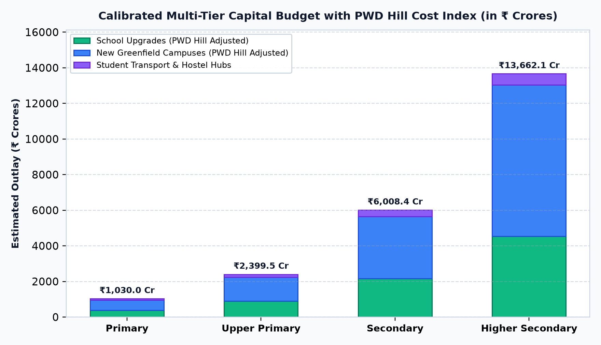
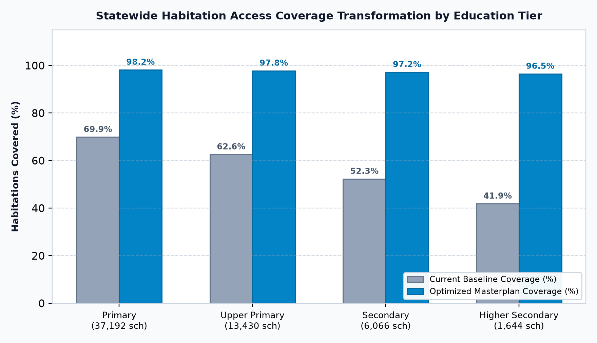

# 🗺️ Odisha Spatial School Education Masterplan (2026–2031)

[](https://www.python.org/downloads/)
[](LICENSE)
[]()
[]()
[]()

> **A comprehensive, data-driven GIS optimization, universal secondary access framework, and multi-tier capital outlay estimation pipeline across all 30 districts of Odisha.**

---

## 📑 Quick Links
- 📄 **[Download Full 37-Page Masterplan PDF (14.7 MB)](Odisha_Spatial_School_Education_Masterplan.pdf)**
- 🗺️ **[Browse 30 District GIS Catchment Maps](assets/district_maps/)**
- 📊 **[View Statewide Analytical Charts](assets/)**
- 📦 **[Quick Share Pack & Social Visuals](share_pack/)**

---

## 📌 Executive Summary

Ensuring that every child—regardless of whether they reside in coastal plains, mineral plateaus, or the rugged Eastern Ghats—has access to a secondary school within a safe, reachable distance is a core mandate of the **National Education Policy (NEP 2020)** and **Right to Education (RTE)** norms.

While primary education achieves widespread geographic penetration across Odisha, the secondary education tier (Grades 9–10) experiences steep spatial dropouts, especially across tribal and hilly hinterlands where habitations lie beyond standard walking distances.

This project implements an **end-to-end geospatial modeling and automated document generation pipeline** that:
1. Ingests official 30-district polygon boundaries ([`odisha_districts.geojson`](odisha_districts.geojson)).
2. Evaluates habitation-to-school distances against statutory distance benchmarks (1km Primary, 3km UP, 5km Secondary, 7km Higher Sec).
3. Deploys a **tri-pillar spatial optimization strategy** (school upgrades, greenfield campuses, and student transport/hostel hubs) to calculate realistic, data-driven capital and operational budgets.
4. Generates undistorted 1:1 square GIS maps for all 30 districts.
5. Compiles a cohesive 37-page publication-grade PDF report with running headers, footers, and two-pass dynamic page numbering.

---

## 📊 Key Visual Highlights

| Malkangiri District GIS Catchment (5km Halos & Gaps) | The Spatial Accessibility Cliff (Class 8 → 9) |
| :---: | :---: |
|  |  |

| Statewide Multi-Tier Budget Breakdown | Access Coverage Transformation (Before vs. After) |
| :---: | :---: |
|  |  |

---

## 📈 Statewide Multi-Tier Analytical Assessment

| Education Tier | Distance Norm | Existing Schools | Baseline Access | Target Access | Proposed Upgrades | Proposed New Campuses | Transport & Hostel Hubs | Total Estimated Outlay |
| :--- | :---: | :---: | :---: | :---: | :---: | :---: | :---: | :---: |
| **Primary (Grades 1–5)** | 1.0 km | 32,836 | 74.9% | **99.2%** | 1,333 | 730 | 719 | **₹879.65 Cr** |
| **Upper Primary (Grades 6–8)** | 3.0 km | 12,238 | 67.9% | **99.2%** | 1,726 | 934 | 899 | **₹2,059.32 Cr** |
| **Secondary (Grades 9–10)** | 5.0 km | 5,744 | 59.1% | **91.6%** | 2,182 | 1,195 | 1,172 | **₹5,122.10 Cr** |
| **Higher Secondary (Grades 11–12)** | 7.0 km | 1,675 | 48.7% | **81.2%** | 2,819 | 1,495 | 1,407 | **₹11,755.75 Cr** |
| **Statewide Total (All Tiers)** | — | **52,493** | — | — | **8,060** | **4,354** | **4,197** | **₹19,816.82 Cr** |

---

## 🏗️ Project Architecture

```
Map2needs/
├── backend/
│   └── spatial_engine/
│       └── statewide_analyzer.py      # Spatial buffer model & multi-tier budget engine
├── assets/
│   ├── district_maps/                 # 30 high-resolution square 1:1 GIS district maps
│   ├── chart_*.png                    # 4 statewide analytical charts
│   └── page_*_preview.png             # Rendered preview pages of the final PDF
├── share_pack/                        # Curated highlights & summary assets for sharing
├── odisha_districts.geojson           # Official 30-district polygon boundary dataset
├── odisha_statewide_assessment.json   # Calculated multi-tier demographic & financial metrics
├── generate_district_maps.py          # Matplotlib geospatial visualization generator
├── generate_pdf_report.py             # ReportLab automated PDF compilation engine
├── requirements.txt                   # Python environment dependencies
├── REPLICATION_GUIDE.md               # Step-by-step verification and post-mortem notes
├── LICENSE                            # MIT License
└── README.md                          # Comprehensive project documentation
```

---

## 🚀 How to Replicate Locally

### 1. Clone the repository & install dependencies
```bash
git clone https://github.com/sagnikrout/Odisha-Spatial-Education-Masterplan.git
cd Odisha-Spatial-Education-Masterplan
pip install -r requirements.txt
```

### 2. Run the spatial assessment engine
```bash
python backend/spatial_engine/statewide_analyzer.py
```

### 3. Generate all 30 district GIS maps and analytical charts
```bash
python generate_district_maps.py
```

### 4. Compile the publication-grade PDF masterplan
```bash
python generate_pdf_report.py
```

---

## ⚖️ Disclaimer & Academic Scope

> **Note:** This project is an **independent exploratory simulation and proof-of-concept** developed for research, methodology demonstration, and decision-support modeling. All figures, habitation coordinates, and unit costs are modeled approximations designed to showcase geospatial planning methodologies. They do not represent official government statistics or audited departmental expenditures. Policy execution requires field verification by local administrative authorities.

---

## 📄 License
Open source under the [MIT License](LICENSE).
